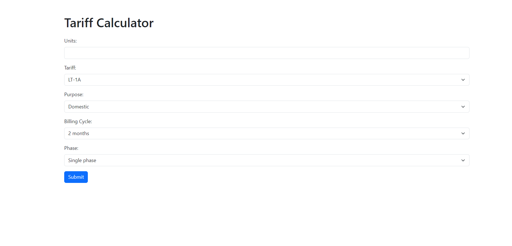
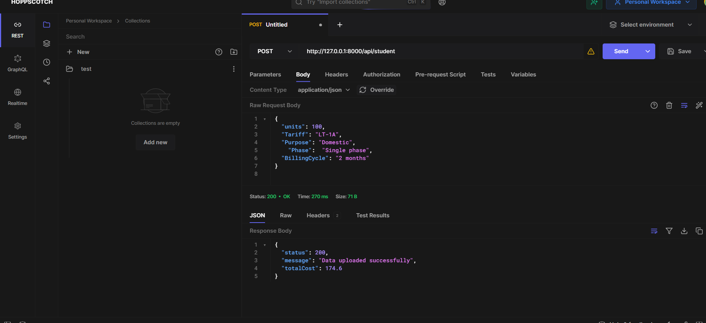
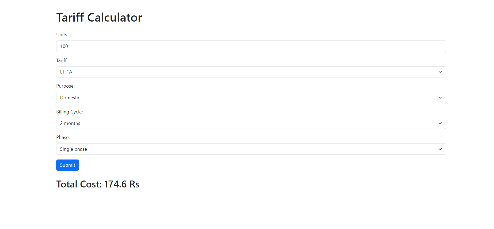

# Tariff Calculator

## Overview

Tariff Calculator is a web application that helps users calculate their electricity tariffs based on various parameters such as units consumed, tariff rates, billing cycle, and phase.

The project consists of two main parts:
1. Frontend: Built using React, this part of the application provides the user interface for inputting tariff information and displaying the calculated tariff.
2. Backend: Developed using Laravel, the backend handles API requests from the frontend, processes the tariff calculation logic, and sends back the calculated tariff to the frontend.

## Prerequisites

Before running the Tariff Calculator, ensure you have the following installed:
- Node.js and npm (for React frontend)
- PHP and Composer (for Laravel backend)
- MySQL or another supported database for Laravel

## Getting Started

### Frontend (React)

1. Clone the repository: `git clone https://github.com/Akash-Saji/Tariff_Calculator.git`
2. Navigate to the frontend directory: `cd front_end`
3. Install dependencies: `npm install`
4. Start the development server: `npm start`
5. Access the application at `http://localhost:3000/`

### Backend (Laravel)

1. Navigate to the backend directory: `cd back_end`
2. Install Laravel dependencies: `composer install`
3. Create a `.env` file from `.env.example` and configure your database settings
4. Generate a new application key: `php artisan key:generate`
5. Run database migrations to create tables: `php artisan migrate`
6. Start the Laravel development server: `php artisan serve`
7. Access the API at `http://127.0.0.1:8000/api/student`

## Screenshot

## Usage

1. Open the Tariff Calculator frontend in your browser.
2. Fill in the required fields such as units consumed, tariff rate, billing cycle, and phase.
3. Submit the form to the backend API.
4. Receive the calculated tariff and display it on the frontend.

